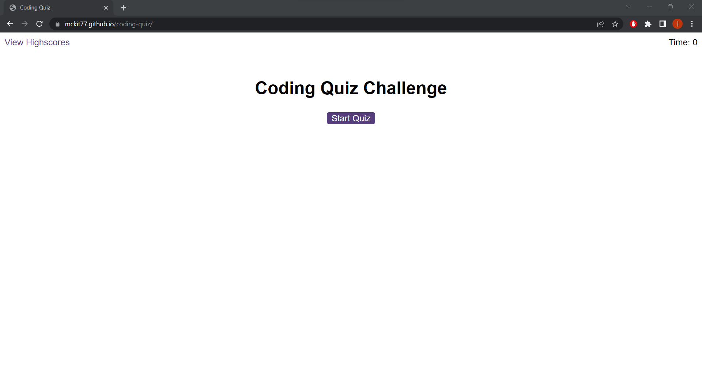
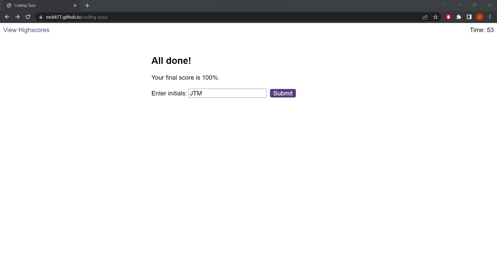
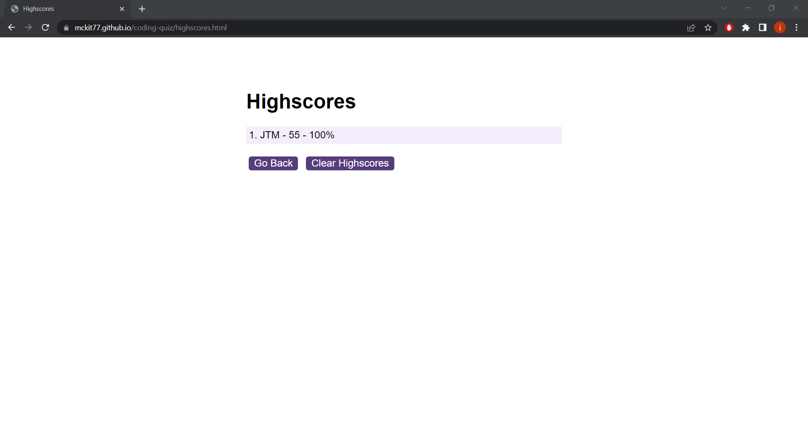

# Coding-Quiz
A quiz focused around coding and web development. (Easy - Medium Difficulty)

## How To Use
To start the quiz, click the "Start Quiz" button. You will have 60 seconds to answer 5 questions. If a question is missed, you will hear an incorrect sound and lose 15 seconds from your timer in the top right of screen. If answer is answered correctly you will hear a correct sound and not lose any time from your timer.

To view the highscores, you can click "View Highscores" on top left of screen. Once viewing high scores, you can click "Clear Highscores" button. To go back to quiz, click 'Go Back' button.

## Where to Find It

view the github page here: https://mckit77.github.io/coding-quiz/

view the github repo here: https://github.com/MCKIT77/coding-quiz

## What Quiz Looks Like

